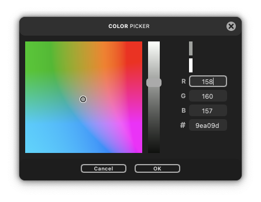

# labcolorpicker
Simple visual Color Picker with a modern UI created with qtpy to easily get color input from the user.




## Installation

Install using pip directly from GitHub:

   ```
   pip install git+https://github.com/yig/pyqt-colorpicker
   ```

## Usage

To ask for a color, import the `getColor` function and run it:

   ```python
   from labcolorpicker import getColor
   
   color = getColor()
   ```

To get a callback whenever the user changes the active color, create 

```
from labcolorpicker import ColorPicker, rgb2lab
my_color_picker = ColorPicker()

def currentColor( color ):
    print( "Current color:", color )

my_color_picker.currentColorChanged.connect( currentColor )

# pass a default red color
color = my_color_picker.getColor( rgb2lab( 200, 0, 0 ) )
```

## Customization

* **Showing custom last color:**

   ```python
   old_color = (100,0,0)
   picked_color = getColor(old_color)
   ```

* **Changing the UI Theme**

  ```python
  from labcolorpicker import useLightTheme
  
  useLightTheme(True)
  ```

* **Adding Alpha selection**

  ```python
  from labcolorpicker import useAlpha
  
  useAlpha(True)
  ```

  When the ColorPicker uses Alpha, you have to pass a LABa tuple
  as the last color, otherwise there wil be an error.

  ```python
  old_color = (100,0,0,100)
  picked_color = getColor(old_color)  # => (L,A,B,a)
  ```

## Color Formats and Conversion

* The default format `getColor` will give you is LAB(a),\
  but you can use labcolorpickers color conversion functions\
  if you have a different format like RGB or HEX.

   `lab2rgb` **LAB** to **RGB**\
   `rgb2lab` **RGB** to **LAB**\
   `rgb2hex` **RGB(A)** to **HEX**\
   `hex2rgb` **HEX** to **RGB**\
   `hex2lab` **HEX** to **LAB**\
   `lab2hex` **LAB** to **HEX**

* Example:
  ```python
  from labcolorpicker import getColor, lab2rgb, rgb2lab
  
  old_color = rgb2lab((50,50,100))  # => (23.267716436315546, 14.98316950336448, -29.63294942493928)

  picked_color = lab2rgb(getColor(old_color))
  ```

* **Color Formats:**

  **RGB** values range from **0** to **255**\
  **LAB** values range from **0** to **100** for L, **-128** to **128** for AB\
  **HEX** values should be in format: `"XXXXXX"` or `"xxxxxx"`\
  **Alpha** values range from **0** to **100**

## License

  This software is licensed under the **MIT License**.\
  More information is provided in the dedicated LICENSE file.
